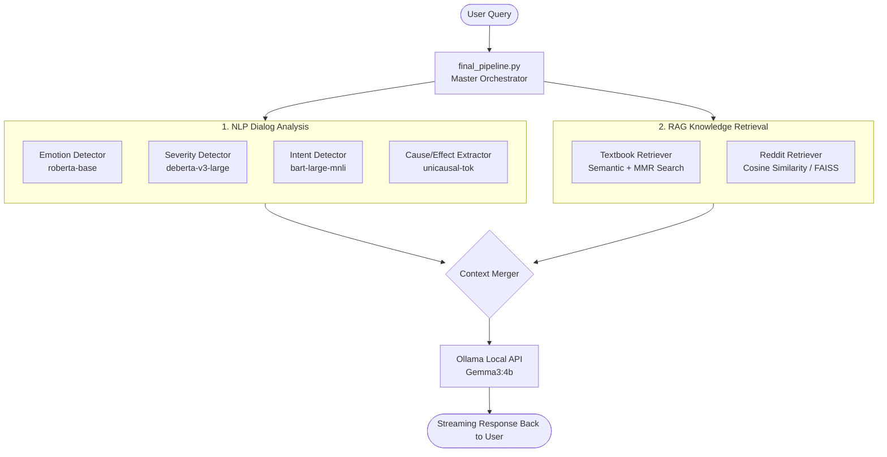

# 🧠 MindMend: Mental Health AI Chatbot

Welcome to the **MindMend** backend! This project is an advanced, privacy-first Mental Health AI Chatbot. It runs entirely locally on your machine, leveraging state-of-the-art NLP models for dialog analysis, a dual-RAG (Retrieval-Augmented Generation) system reading from both clinical textbooks and Reddit discussions, and the Gemma LLM via Ollama to generate highly empathetic, context-aware advice.

---

## 🏗️ System Architecture

Before diving in, here is a high-level overview of how the data flows when a user asks a question:



### How It Works:
1. **User Query**: The user types a message in the terminal.
2. **Dialog Analysis (`pipeline.py`)**: The system analyzes the text to find the user's primary emotion, the severity of the crisis, their intent (e.g., "seeking advice"), and extracts root causes and effects.
3. **Retrieval (`retrievers/`)**: 
   - **Textbooks**: It searches through chunks of 5 major psychology textbooks using semantic embeddings.
   - **Reddit**: It searches through 20,000+ real-world Reddit discussions (from r/ADHD, r/OCD, etc.) to find peer experiences.
4. **LLM Generation (`summarizers/gemma_summarizer.py`)**: All of this structured data is bundled into a massive prompt and sent to a local LLM, which streams back a compassionate, clinically-informed, and peer-supported response.

---

## 🚀 Step-by-Step Setup Guide
## 🚀 Step-by-Step Setup Guide

Follow these steps exactly to get the project running. 

### Step 1: Install Prerequisites
1. **Python 3.10+**
2. **Ollama**: Download and install [Ollama](https://ollama.com/) on your computer. Keep the application running in the background.

### Step 2: Set Up Python Environment
Open your terminal and run:
```bash
python3 -m venv venv
source venv/bin/activate  # On Windows: venv\Scripts\activate
pip install -r requirements.txt
```

### Step 3: Download the Required Data (Crucial!)
Because the raw data files are too large for GitHub, you must download and place them in the correct folders before running the app.
1. **Textbooks**: Place your clinical psychology PDF books inside the `data/books/` folder.
2. **Reddit Data**: Place the Reddit CSV files (e.g., `train_adhd.csv`, `train_ocd.csv`) inside the `data/reddit/` folder.

### Step 4: Download the Local LLM (Ollama)
We use Google's `gemma3:4b` to generate responses. Ensure Ollama is running, then type:
```bash
ollama pull gemma3:4b
```
*(⚠️ Download Size: ~3.3GB)*

### Step 5: Build the Knowledge Graphs
You must generate the dense vector embeddings locally so the bot can search the textbooks. Run these two commands **once**:
```bash
python3 -m retrievers.knowledge_graph.ingest             # Parses books into paragraphs
python3 -m retrievers.knowledge_graph.ingest_embeddings  # Generates searchable embeddings
```

---

## 💻 Running the Chatbot

To start the chatbot, run:
```bash
python3 final_pipeline.py
```

### What happens on the FIRST run?
The very first time you run this command, **Hugging Face will automatically download 4 massive AI models** into your computer's cache (`~/.cache/huggingface`). 
- **Emotion Model** (`roberta-base`)
- **Severity Model** (`deberta-v3-large`)
- **Intent Model** (`bart-large-mnli`)
- **Cause Extractor** (`unicausal-tok`)

*(⚠️ Total Download Size: ~5GB. This will take several minutes and you must be connected to the internet. Subsequent runs will load instantly!)*
1. **Loading Phase**: The script will initialize 4 heavy NLP models (Emotion, Cause, Intent, Severity). If this is your first time running it, Hugging Face will automatically download the model weights (this takes a few minutes but caches them permanently).
2. **Retrieval Phase**: It will load the FAISS indices and Reddit CSV data into your RAM.
3. **Interactive Mode**: A `You:` prompt will appear. You can type any mental health concern.
4. **Streaming**: The response will stream out word-by-word just like ChatGPT!

Type `quit` at any time to exit the program.

---

## 📂 Project Structure Breakdown

For developers looking to modify the code, here is where everything lives:

- **`final_pipeline.py`**: The master entry point. Ties the whole system together and runs the terminal UI.
- **`pipeline.py`**: The orchestrator for the NLP models. Given a string of text, it runs it through all 4 detectors and returns a structured dictionary.
- **`metrics/`** *(formerly detectors)*: Houses the standalone NLP classification models:
  - `emotion.py` (roberta-base)
  - `severity.py` (deberta-v3-large)
  - `intent.py` (bart-large-mnli)
  - `cause_bosch/` (custom token classification)
- **`retrievers/`**: Houses the RAG search engines:
  - `book_retriever.py` (Queries the generated textbook embeddings)
  - `reddit_retriever.py` & `faiss_reddit_retriever.py` (Queries the Reddit Q&A datasets)
- **`summarizers/`**:
  - `gemma_summarizer.py`: Handles the HTTP connection to Ollama and streams the response tokens to the terminal.
- **`api.py`**: A FastAPI wrapper (if you want to hook this backend up to a React/Next.js frontend instead of using the terminal).

Happy building! 🧠💙